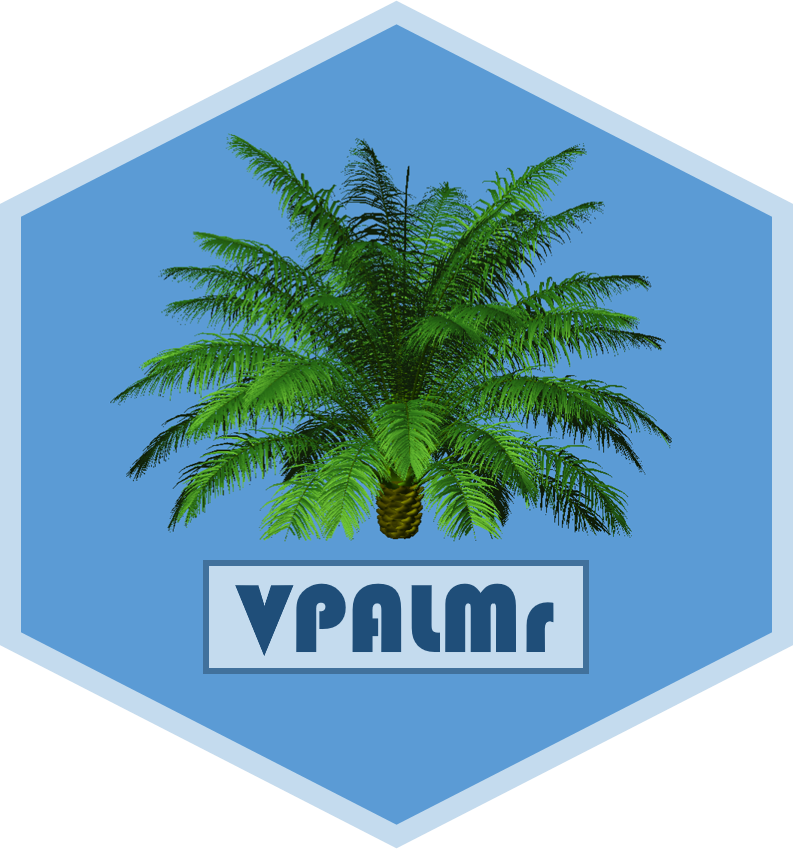

<!-- README.md is generated from README.Rmd. Please edit that file -->

```{r setup, include = FALSE}
knitr::opts_chunk$set(
  collapse = TRUE,
  comment = "#>",
  fig.path = "man/figures/README-",
  out.width = "100%"
)
```
# Vpalmr 

The goal of Vpalmr is to ease the process of making virtual palm plants from field data.

The data preparation, the models and all details are described in the [PhD of R. Perez](https://www.researchgate.net/publication/318351549_Analyzing_and_modelling_the_genetic_variability_of_aerial_architecture_and_light_interception_of_the_oil_palm_Elaeis_guineensis_Jacq?_sg=KZ3K7bz0sNnV3iRwaYehauoZ0rn6Lc0MDO3O3tyXR-j9QzT4ODe9zb6ySgPOAXzoJhHXloiAo7CA5SYE8TsD7dd3SldfET7k8Iy-CuKf.cKm7AfKFCz6-jBiO4jl27VWnrz_HvA_KI0RNwUQgIQfQzoL2Dj9HLol3pv95Qb9vzkq7AoICAb4IH77DV3rgAQ) and the subsequent articles [@Perez2016; @RN1342; @PEREZ2018250; @RN1350; @Perez2017]


## Installation

The development version from [GitHub](https://github.com/) can be installed with:

``` r
# install.packages("devtools")
devtools::install_github("VEZY/Vpalmr")
```

Or using the lightweight [remotes](https://github.com/r-lib/remotes#readme) package: 

``` r
install.packages("remotes")
remotes::install_github("VEZY/Vpalmr")
```

## References
